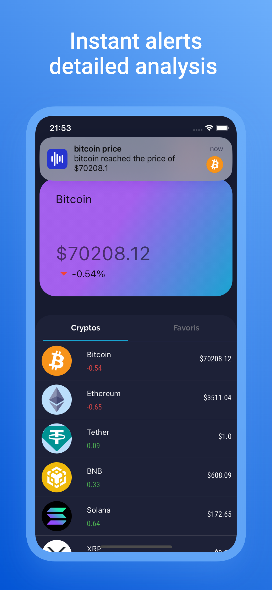
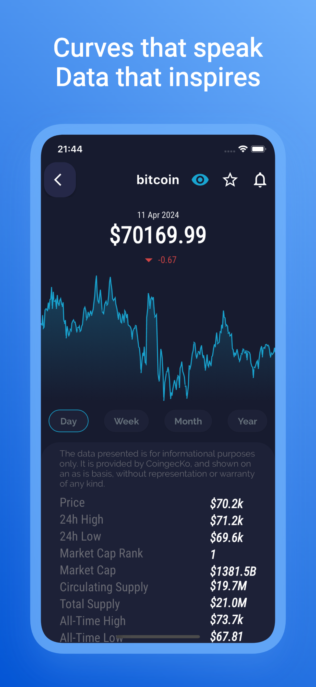
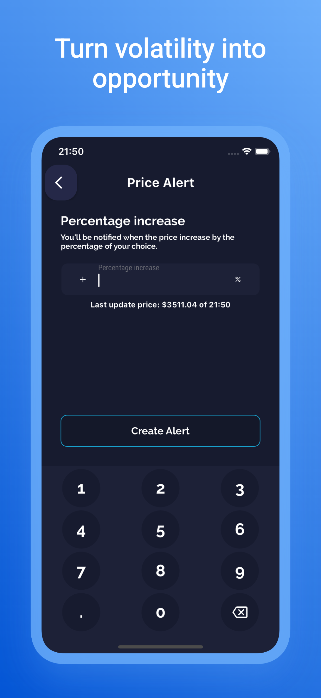

# Freemarket Stock App

<p align="center">Welcome friends! This is the codebase for the Freemarket Stock App.<p>

<p align="center">
  
  
  
</p>

# Features  

- Track real-time cryptocurrency prices.  
- Receive personalized price alerts.  
- Analyze trends with interactive charts. 

# User Installation 
Get the app itself:
- **ios**: [App Store](https://apps.apple.com/app/freemarket/id6480411884)
- **Android**: Coming soon! 

# Built with
- **[Flutter](https://docs.flutter.dev/)** : For building cross-platform apps with a single codebase
- **[CoinGecko API](https://docs.coingecko.com/reference/introduction)** : For fetching real-time cryptocurrency data.

# Getting started with development

Follow these steps to set up and run the Freemarket project on your local machine for development.

### Prerequisites

Ensure you have the following installed:

- **Flutter SDK**: [Installation guide](https://flutter.dev/docs/get-started/install)
- **Dart SDK** (comes with Flutter).
- **Xcode** (for iOS development) or **Android Studio** (for Android development).
- A code editor like [Visual Studio Code](https://code.visualstudio.com/) or [Android Studio](https://developer.android.com/studio).
- **Git**: [Download Git](https://git-scm.com/).

### Firebase Setup

To configure Firebase for the project, follow these steps:

1. **Create a Firebase Project**  
   Go to the [Firebase Console](https://console.firebase.google.com/), create a new project, and follow the setup instructions.

2. **Add Firebase to your Flutter app**  
   - For **iOS**, you need to download the `GoogleService-Info.plist` file from Firebase and add it to your iOS project directory (in the `ios/Runner` folder).
   - For **Android**, download the `google-services.json` file from Firebase and place it in the `android/app` directory.

3. **Enable Firebase Services**  
   Depending on the services you're using in the app (e.g., Firebase Authentication, Firebase Firestore, Firebase Analytics), enable them in the Firebase console and follow any additional setup steps outlined in the Firebase documentation.

4. **Install Firebase Flutter Plugins**  
   In your `pubspec.yaml`, add the necessary Firebase dependencies. For example:
   
   ```yaml
   dependencies:
     firebase_core: ^latest_version
     firebase_auth: ^latest_version
     cloud_firestore: ^latest_version
     # Add other Firebase services you plan to use

### Setup Instructions

1. **Clone the Repository**  
   Clone the project to your local machine using Git:
   ```bash
   git clone https://github.com/vuzzer/freemarket.git
   cd freemarket

2. **Install Dependencies**
   ```bash
    flutter pub get
   ```

3. **Run the Project**

   Run the app on a connected device or emulator
   ```bash
      flutter run
   ```

4. **Troubleshooting**

   If you encounter SDK-related errors, verify your Flutter installation by running :
   ```bash
     flutter doctor
   ```

# License  

This project is licensed under the MIT License. See the [LICENSE](./LICENSE) file for details.


